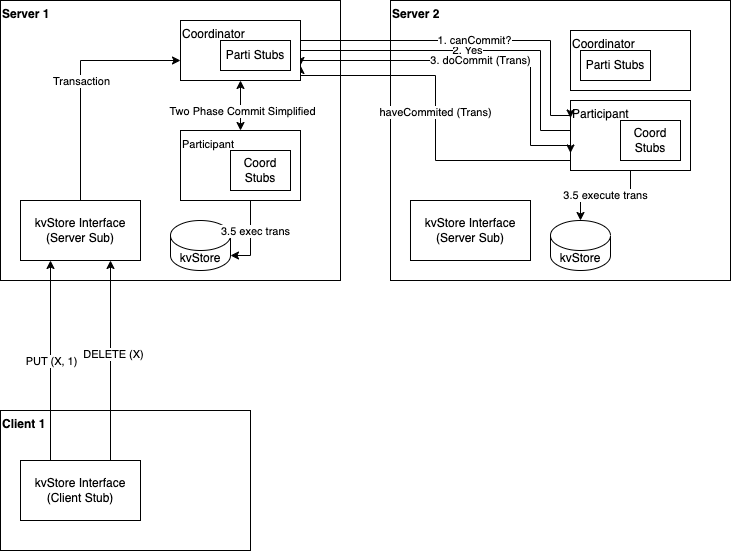

## Where are Phase III Main Implementations?
- Servers initialization and coordination is in `RPCHandler`
- Five kvStore/Server processes are started in `ServerApp`
- Two-phase commit is implemented in `CoordinatorImpl` and `ParticipantImpl` classes
- Once the server and a client instances are started, please check server log to see the two-phase commit in action

## System Design Diagram



## How to run the project

#### Instructions
Navigate to `project1_repo/src`
```shell
cd ~/project1_repo/src
```

In the `project1_repo/src`

Start the server.
```shell
chmod +x deploy.sh
bash deploy.sh
```

Start each client on a different console. Starting more clients is possible by giving a different pod name. Only Protocol and Port number supported are RPC and 1099 respectively. There are total 5 servers, client can connect to any of them by specifying the server number.
```shell
chmod +x run_client.sh
bash run_client.sh my-client-one RPC 1099 1# start the first client, connecting to the 1st server
bash run_client.sh my-client-two RPC 1099 2# start the second client, connecting to the 2nd server
```

The client will initialize the kv store. Then followed by 5 Put, 5 Get, 5 Delete operations to demonstrate the 
working of the client

After the automatic operations to demonstrate the client-server communication, the client will be in interactive mode. The client can be used to perform the following operations, feel free to interact with the server through client.
```shell
Enter command (PUT key value / GET key / DELETE key / EXIT): 
PUT key6 value6
GET key6
DELETE key6
EXIT
```

## Executive Summary
First part of the project use database replicas to make our distributed key value store more available and be able to handle more queries. However, duplication 
of data among replicas can lead to inconsistency. For example, an update to one replica may not be reflected in another replica.
The second part of the project resolves the inconsistency problem. Using the two-phase commit, we make sure our transactions
are atomic. Meaning a proposal either reflects in all replicas or none.


## Technical Impression
Reflecting on my experience for project 3, its implementation requires good understanding of coordination and communication between processes. There's some good level
of architecture skill required to achieve our objective. We need to think about how each process/server can independently support 
the requests from clients and at the same time be able to coordinate updates to other servers to ensure data consistency.
To achieve this, I have to thought deeply about what kind of interfaces are needed between servers and servers. I used
RPC for communication. To realize its implementation I need to think about how do we transfer a request from one server to another, 
how do we ensure that the request is received through ACK. What helped me a lot is the architecture diagram I completed before implementation. It helped me think through the
data/communication flow in the system. 

I also faced some challenges. The initial challenge I had was at what level should we implement each server process.
Meaning, if each server should reside in thread, a process, or a pod. Also, it took me sometime to figure out how client request can be passed between
coordinators and participants. There are three types of operations we need to support (GET, DELETE, PUT), modeling those request, and
forwarding those requests took me sometime. Furthermore, we should only have one RPC registry for the whole system, how to
coordinate the registry creation and retrieval for 5 servers was a bit challenging.

[//]: # (## Executive Summary)

[//]: # (Purpose and scope of the assignment helps us to get acquainted with how RPC is used in distributed system. What characterises RPC, and also how RPC could be implemented.)

[//]: # (RPC is a way to invoke a process remotely as though that process is local. It is a way of communication between processes running on different machine.)

[//]: # (To achieve this, RPC need a Interface Definition Language to define how client can interact with the server.)

[//]: # ()
[//]: # ()
[//]: # (The assignment also exposes us to multithreading, way to achieve concurrency in a process. It also encourages student to think about where the race condition)

[//]: # (could occur in our code &#40;in our case, the key-value store which is a shared memory in the same process&#41; and how we can explicitly address the race condition. For)

[//]: # (example with a mutex lock, or using the async keyword in Java. It also allow use to explore increase concurrency of our code using multithreading mechanisms such as)

[//]: # (a threadpool that allows reuse of threads.)

[//]: # ()
[//]: # (## Technical Impression)

[//]: # (There are a few challenges that I faced. I will elaborate on each with more details)

[//]: # (1. Understanding the concept of RPC and how it is implemented with Java RMI.)

[//]: # (2. Think about how to architect the code to enable RPC protocol while maintain its support for the TCP and UDP protocols.)

[//]: # (3. How to use threading to achieve concurrency and where the race condition could arise and in the code and how to address it.)

[//]: # ()
[//]: # (For point number 1. Figuring out Interface Definition Language in RMI is an extension of Remote inference took me a while. Although we do not need to explicitly)

[//]: # (specify any network protocol for communication in RPC/RMI, we still need to create a registry on a port number and bind a remote object to the registry. Then, our client)

[//]: # (code can figure out where to send the request to after looking up the object in the registry.)

[//]: # ()
[//]: # (For point number 2. I have to think about where do add the RPC code and where to modify the existing to support backward compatibility with TCP and UDP. I extended)

[//]: # (my KeyvalueStore as a Remote interface and implemented my RPCHandler as a extension of the HandlerAbstract. Luckily, the extension worked without me modifying much of the)

[//]: # (UPD and TCP code. I spent some error in project phase 1 to think about the architecture that support extension. I am glad that effort paid off. As a result, when we run)

[//]: # (a client, we can choose it to be either TCP, UDP, or RPC based, it all should work.)

[//]: # ()
[//]: # (For point number 3. The RMI is already multithreaded by default, however, we still need to add asynchronous keyword to the method in the IDF &#40;KeyValueStoreImpl class&#41; to prevent)

[//]: # (race condition on the hashmap. I also added a multiple thread to the ServerApp.java to have TCP, UDP, and RPC to run on separate threads. This way, we can have multiple clients types &#40;)

[//]: # (TCP, UDP, RPC&#41; to connect to the server concurrently and write to/read form it safely. Also RPC can handle multiple RPC client threads.)

[//]: # ()
[//]: # (In summary, through the project I gained much better understanding on RPC/RMI. Improved my ability to achitect code that is extensible. I also acquired pratical knowledge on multi-threading)

[//]: # (and multi-processing environment.)

